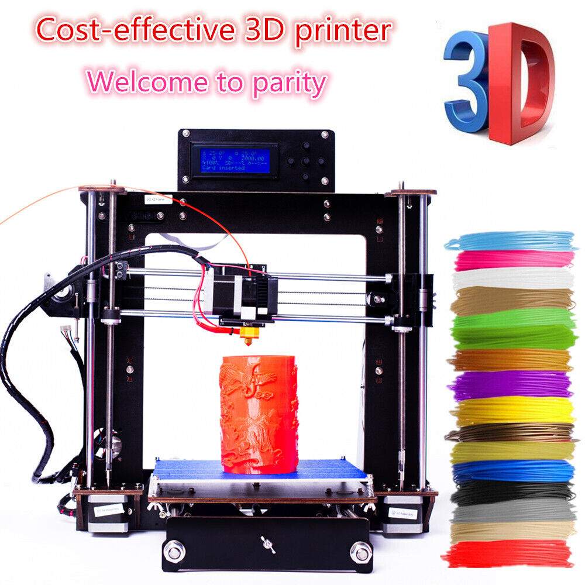
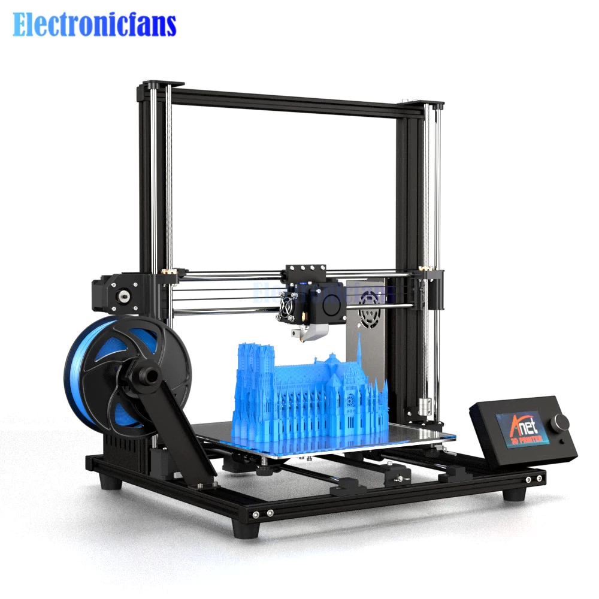

# Mein Anet A8

 und die größere Version.  

Der Anet a8 ist der beliebteste 3D-Drucker im Herbst 2018. In unserem Anet a8 Test erfährst du warum. Mit Infos zur Montage, Upgrades und einen Vergleich mit dem Anet A6.  

Viele Wege führen zum ersten eigenen 3D-Drucker. Firmen bieten fertig zusammengebaute 3D-Drucker an, mit denen man praktisch sofort nach dem Auspacken loslegen kann („Plug & Play“) und auch 3D-Drucker-Bausätze. Für Leute, denen alles andere zu langweilig ist.  

Momentan ist der Prusa i3 MK3 die Messlatte für 3D-Drucker-Bausätze. Die Nachfrage für diese 3D-Drucker ist jedoch so hoch, dass es manchmal Wartezeiten von mehreren Wochen gibt.  

Das ist nichts für Ungeduldige, und auch Sparfüchse werden froh sein, dass es billige und qualitativ gute Alternativen wie den Anet a8 gibt. Bei einem Preis von zwischen 145 € – 200€ findet dieser Prusa-Klon reißenden Absatz auf der Webseite des chinesischen Elektrohändlers Gearbest und hat eine kontinuierlich wachsende Fangemeinde. Der günstige Preis, die Möglichkeit ihn umzurüsten und die Kompatibilität mit den meisten gängigen Materialien lockt immer mehr 3D-Fans mit knappem Budget.  

\(Hier auf [Anet3D.com](https://anet3d.com/pages/a8 "") findet man ganz sicher alles über den 3D Drucker, um es auf dieser Seite einzuarbeiten.  
[FAQ zum A8](https://shop.anet3d.com/blogs/a-series "")  
[Open Source Firmware of A8](https://anet3d.com/blogs/download/open-source-firmware-of-a8 "")  

\)  

Es versteht sich von selbst, dass wir herausfinden wollten, ob der Hype gerechtfertigt ist. Also hat All3DP einen Anet a8 3D-Drucker-Bausatz bestellt und getestet. Ich gebe zu, es war eine ziemliche Herausforderung, so einen 3D-Drucker von Grund auf zusammenzuschrauben, besonders wenn man so etwas noch nie vorher gemacht hat. Zum Glück hatte ich ein paar Helfer und nach ein paar Tagen des Tüftelns und Schraubens haben wir das Gerät zum Laufen gekriegt – und wenn es einmal steht, kann der Spaß auch richtig losgehen.  

Hast auch du Interesse an einen 3D-Drucker-Bausatz, für dessen Anschaffung du nicht extra einen Kredit aufnehmen musst? Dann bist du genau richtig bei unserem Anet a8 Test.  

## Vorteile
* Günstiger 3D-Drucker-Bausatz
* 3D-Drucker mit gutem Preis-Leistungs-Verhältnis
* Umrüstbar
* Es sind sehr viele Erweiterungen als 3D-Druckvorlage verfügbar (drucke sie selbst mit dem eigenen Anet A8)
* Eine hervorragende Art, mehr über das Schmelzschichtungsverfahren zu erfahren
* Die Funktionalität verbessert sich mit jedem Druck und jeder Erweiterung
* Ein anspruchsvolles, aber auch lohnenswertes Projekt

## Nachteile
* Haarsträubende Bauanleitungen
* Ohne 3D-Druck-Erfahrung könnte der Zusammenbau zu anspruchsvoll sein
* Ziemlich steile Lernkurve
* Die Benutzeroberfläche ist nicht sehr praxistauglich
* Ein perfekter Druck erfordert Zeit und Geduld
* Die manuelle Kalibrierung ist etwas mühsam (eine automatische Druckbettausrichtung ist nur gegen Aufpreis erhältlich)
* Das Design ist nicht besonders ästhetisch

## Zusammenfassung

Wir haben uns im folgenden Anet a8 Testbericht insbesondere auf die Montage und die Druckleistung konzentriert. Unsere wichtigsten Erkenntnisse: Der Drucker ist nicht leicht zusammenzubauen, aber er liefert für den günstigen Preis tolle Druckergebnisse.  

Zur Bewertung der Montage und der Druckqualität findest du unten noch detailliertere Infos, zunächst aber möchten wir dir unseren Gesamteindruck des Anet a8 vorstellen. Berücksichtigt man den Preis, das Potenzial und die Druckqualität des Anet A8, darf man eigentlich kein schlechtes Wort über diesen 3D-Drucker-Bausatz verlieren.  

Trotzdem sind wir auf einige Mängel gestoßen. Das Hauptproblem des Anet a8 ist, dass man sehr viel Zeit, Geduld und Können für die Montage und Optimierung benötigt. Dabei ist es auch gar nicht nur der Aufbau, der relativ komplex ist (gerade für Anfänger!), auch das manuelle Kalibrieren des Druckbetts erfordert viel Geduld und höchste Präzision.  

Hat man diese Schritte aber einmal gemeistert, bringt der 3D-Drucker viel Spaß. Auch bei uns gab es Komplikationen, doch waren die einmal überwunden, lernten wir eine ganze Menge und sind nun gewappnet für zukünftige Porjekte. Vielleicht ist es ja wirklich unmöglich, diesen Drucker ohne Hindernisse zum Laufen zu bringen.  

Aber das Gefühl, Probleme selbst erkannt und behoben zu haben, entschädigt am Ende für alle Strapazen. Insofern ist der Anet a8 ein idealer 3D-Drucker-Bausatz für ehrgeizige und zielstrebige Anfänger, sowie für erfahrene 3D-Fans mit kleinem Budget.  

## Merkmale & technische Daten

Der Anet a8 3D-Drucker-Bausatz ermöglicht eine Schritt-für-Schritt-Lernerfahrung. Er hat einen schwarzen Acrylrahmen mit einem Bauraum von 220 x 220 x 240 mm Größe und ist mit vielen Filament-Materialien kompatibel, etwa mit ABS, PLA, Holzfilmant, Nylon PVA und PP.  

Zu den Besonderheiten zählen Filamentrollen aus Metall, ein Quick-Release-Vorschubgetriebe für die Filament-Extrusion, Schienen, Zahnräder, Gewinde und Lager aus Edelstahl und verschiedene Anschlüsse.  

Was die Kompatibilität mit dem PC anbelangt, gibt es so gut wie gar keine Einschränkungen. Der Anet a8 läuft mit Windows XP, Windows 7, Windows 8, Windows 10, Mac und Linux.  

## Anet a8 Spezifikationen

* Bauraum: 220 x 220 x 240 mm
* Rahmenmaterial: Schwarze Acrylplatten
* Druckbett-Platte: Aluminiumlegierung
* Extruder-Düsen: 1
* Durchmesser der Extruder-Düse: 0.4 mm
* Layerhöhe: 0.1 – 0.3 mm
* Offline-Druck mit SD-Karte
* LCD-Bedienfeld: Ja
* Druckgeschwindigkeit: Bis zu 100 mm/s
* Filamentdurchmesser: 1,75 mm
* Dateiformat: G-Code, OBJ, STL
* XY-Achse Ausrichtungsgenauigkeit: 0.012 mm
* Z-Achse Ausrichtungsgenauigkeit: 0,004 mm
* Stromspannung: 12 V
* Software des Host-Computers: Cura, Repetier-Host
* Verpackungsart: 3D-Drucker-Bausatz
* Zertifikate: EMC, FCC, LVD, RoHs

# Unboxing

Der Anet a8 3D-Drucker ist im wahrsten Sinne des Wortes ein Bausatz. Beim Öffnen des Versandkartons fanden wir drei Styroporbehälter vor, in denen alle Puzzleteile ordentlich verstaut waren.  

Die Anordnung der Einzelteile war akkurat und die Beschriftung deutlich. Die Oberfläche jedes Acrylteils ist mit Klebeband geschützt. Dies hilft zwar, den Rahmen vor Kratzern zu schützen, aber das Entfernen dauert auch eine gewisse Zeit.  

Bei ungefähr 38 einzelnen Acrylteilen, von festen Teilen für den Motor bis hin zum eigentlichen Rahmen, braucht es auf jeden Fall Zeit, um vorsichtig das braune Klebeband vom schwarzen Plexiglas zu entfernen.  

Das Anet a8 3D-Drucker-Bausatz enthält außerdem eine große Auswahl an verschiedenen Schrauben und Muttern, die jeweils zusammen verpackt und entsprechend gekennzeichnet sind. Andere Bauteile, wie etwa der Extruder, Gewinde, Motoren und natürlich das Motherboard und das Netzteil, sind sicher verstaut und entsprechend gekennzeichnet.  

Trotz des säuberlichen Arrangements aller Teile fiel uns auf, dass etwas Entscheidendes im Anet a8 3D-Drucker-Bausatz fehlte. Es gab keine analoge Gebrauchsanweisung in der Verpackung, sodass dem Benutzer kein sofort zugängliches Handbuch zur Verfügung stand. Das Team von Anet setzt ganz auf eine digitale Bedienungsanleitung und liefert deshalb einen USB-Stick mit, der eine Schritt-für-Schritt Installationsanleitung, Betriebshinweise und Hilfe zur Fehlerbehebung enthält.  

Abgesehen von der Montageanleitung und anderen Anweisungen enthielt der USB-Stick auch Beispiel-3D-Drucke, Slicing-Softwareeinstellungen, Fotos und sogar einen Link zu einem Video des Installationsprozesses.  

Da viele Videoanleitungen bevorzugen, möchten wir gleich darauf hinweisen, dass manche Elemente der Videoanleitung ziemlich schlampig gemacht sind. Während des gesamten Aufbauprozesses entfernt der Anet-A8-Monteur die Aufkleber nicht vom Acrylrahmen. Wenn der 3D-Drucker vollständig montiert ist, ist es unmöglich, diese Aufkleber vollständig zu entfernen ohne den 3D-Drucker nochmal komplett auseinander zu nehmen.  

Ein anderes Problem des Montagevideos ist, dass der Anet a8 inzwischen an der einen oder anderen Stelle verändert wurde und das Video somit nicht mehr 100 % aktuell ist.  

Wir haben uns also dazu entschlossen, die Bedienungsanleitung vom USB-Stick auszudrucken. Es erschien uns notwendig, die Montagebeschreibung in die Bewertung unseres Anet a8 3D-Drucker-Tests einzubeziehen. Im Großen und Ganzen fiel es uns leicht, den Anweisungen zu folgen, nur manchmal war die Anleitung nicht ganz klar.  

In den Fällen, in denen die Anet a8 Installationsanleitung nicht ausreichte oder wir einfach noch eine andere visuelle Stütze brauchten, griffen wir auf das sehr gut bewertete Video des [YouTubers Osdoyi PhD](https://youtu.be/nSdP-1c4WQI "") zurück.  

## Montage

Bevor wir zu der Leistungsfähigkeit des Anet a8 3D-Druckers kommen, wollen wir uns dem langwierigen Montageprozess widmen.  

Diejenigen, die das Tüfteln lieben und Lust auf eine Geduldsprobe haben, sollten viel Freude bei der Montage des Anet a8 3D-Druckers haben. Für Leute mit wenig Erfahrung ist dieser 3D-Drucker-Bausatz jedoch eine echt komplizierte Herausforderung.  

Während der Montage des Anet a8 versuchten wir mit der Bedienungsanleitung des Herstellers zurechtzukommen. Jedoch gab es Stellen in der über dreißig Schritte umfassenden Anleitung, die uns nicht klar genug erklärt waren. In solchen Situationen konsultierten wir zusätzliche Videos und Fotos, um sicherzustellen, dass wir auf dem richtigen Weg waren.  

Im ersten Schritt der Montage des Anet a8 muss man den Acrylrahmen des 3D-Druckers zusammenbauen. Die untere Stützplatte dient als Basis für die zwei aufrechten Seitenstützplatten. Schritt Eins umfasst auch die obere Trägerplatte, an der das LCD-Display gegen Ende des Montageprozesses montiert wird.  

Du benötigst eine handvoll M3x18-Schrauben und M3-Muttern, um den Acrylrahmen zusammenzusetzen. Glücklicherweise spart der chinesische Hersteller nicht an diesen Kleinteilen. Als nächstes werden die zwei „Halteplatten-Verriegelungsplatten“ (support plate lock plates) oben auf dem Rahmen montiert. Sie halten später die Z-Führungsschiene fest.  

Nachdem die Basis des Rahmens zusammengesetzt ist, wird der Y-Achsenmotor angebaut. Befestigt an der oberen Acryl-Rückplatte, wird der Y-Achsen-Motor zusammen mit dem Y-Achsen-Endschalter zwischen den zwei Stützplatten fixiert. Wir bemerkten, dass dies der erste Schritt in der Installationsanleitung war, bei dem einige entscheidende Details fehlten.  

Auch wenn die grundlegende Montage des Motors der Y-Achse klar war, zeigten die Anweisungen nicht genau, wie der Motor angebracht werden soll, damit die Anschlussstifte an der richtigen Stelle sind. (Hinweis: die Antwort ist, dass der Anschluss des Y-Achsenmotors nach oben Richtung Rahmen zeigen soll).  

Für Leute mit Erfahrung in Sachen 3D-Drucker-Bausätze ist das vielleicht selbsterklärend, für Neulinge in dem Bereich lauert hier jedoch eine Falle, denn woher sollen sie wissen, wie sie den Y-Achsenmotor anordnen sollen? Nachdem der Motor an der Acryl-Rückplatte montiert wurde, fixiert man das ganze Bauteil am Rahmen.  

Als nächstes musste die Y-Achsen-Zahnriemenlagerstütze an der Frontplatte befestigt werden, wo der Zahnriemen in späteren Schritten eingesetzt wird. Dafür verwendest du die beiden 400 mm Gewindestäbe, führst sie von der Rückseite nach vorne und befestigst sie mit M8-Muttern und M8-Distanzringen.  

Diese Gewindestangen werden schon bald durch das Druckbett verdeckt, es ist deshalb wichtig, dass du alles gut befestigst und absicherst, bevor du weitermachst. Sobald die Gewindestangen sicher am Boden des Anet a8 Rahmens befestigt sind, werden die beiden Y-Achsen-Führungsstangen (380 mm) durch die Löcher neben den Gewindestangen eingeführt. Diese Lager spielen eine entscheidende Rolle im nächsten Schritt, wenn es darum geht, das beheizte Druckbett anzubringen.  

Das beheizte Druckbett des Anet a8 3D-Druckers besteht aus einer Aluminiumplatte, die auf die Lager montiert wird und dem eigentlichen Druckbett, das darüber kommt. Unter der H-förmigen Aluminiumplatte werden die Fixierklammern des Y-Achsenzahnriemens befestigt. Diese kleinen Acrylteile halten den Y-Achsenriemen später fest.  

Dieser Teil ist etwas kompliziert… Der Anet a8 wird mit einem 1,5 m langen Zahnriemen geliefert, den du selbst zuschneiden und so anpassen musst, dass er für die X- und die Y-Achse reicht. Gemäß der Anleitung solltest du am Ende noch 10–20 cm Riemen übrig haben.  

Um sicher zu gehen, haben wir unsere Riemen extra großzügig zugeschnitten. Wenn aus Versehen einer der Riemen zu kurz gerät, ist die gesamte Montage deines Anet a8 in Gefahr.  

Es ist auch echt nicht einfach, den Y-Achsenriemen ordentlich zu befestigen. Sobald genügend Spannung vorhanden ist, musst du die Riemenfixierungsklemme schließen, um den Riemenmechanismus in Position zu halten.  

Sobald der Riemen sicher angebracht ist, kannst du das beheizte Druckbett befestigen. Zwischen dem Druckbett und der Aluminiumplatte sind vier Federn, die für die manuelle Kalibrierung gebraucht werden. Die beheizte Druckoberfläche wird mit M3x30-Schrauben und M3-Flügelmuttern zusammengehalten.  

Die folgenden Schritte beschäftigen sich mit der Montage der zwei Z-Achsenmotoren, welche von festen Bauteilen und Stützplatten umfasst werden. Diese Acrylteile passen genau in den Rahmen. Als nächstes werden die linken und rechten Z-Achsen-Mutterstützteile auf den zwei Z-Achsen-Führungsstangen montiert, die von der Oberseite des Rahmens in das Acrylgehäuse für die Z-Achsenmotoren eingeführt werden.  

Nun sollte der Z-Achsen-Endschalter auf der rechten Z-Achsen-Mutterhalterung angebracht werden. Der Installationsleitfaden erwähnt dies jedoch nicht im Text, sodass wir dies anhand der Fotos herausfinden mussten.  

Nach dem Anbringen der beiden X-Achsen-Stäbe und Linearlager haben wir den Extruder des Anet a8 montiert. Bei diesem Schritt musst du erst die Schraube lösen, die den Mechanismus zusammenhält (Vorsicht, die Feder neigt dazu, während des Lösens herauszuplatzen), und dann den Ventilator, die Kühlrippe und die Lüfterabdeckung am Extruder befestigen.  

Der Extruder ist in den Schlitten eingebaut, der an den Lagern der X-Achsenstangen befestigt ist. Dieser Teil der Montage wurde abgeschlossen, indem wir das 5015-Luftgebläse und die Windöffnung an der Vorderseite des Extruders befestigten.  

An diesem Punkt beginnt man zu erahnen, wie der Anet a8 3D-Drucker aussehen wird, aber es bleiben noch ein paar Etappen bis zum Ziel. Die letzte schwierige Aufgabe ist das Einsetzen und Befestigen des X-Achsen-Riemens. Zwei Schrauben kommen an die Rückseite des Extruder-Schlittens, dann muss der Riemen herumgewickelt und mit einem Verschluss geschlossen werden.  

Es ist nicht einfach, die gezahnte Seite des Riemens um den X-Achsen-Motor herum zu bekommen, mithilfe einer Pinzette oder etwas ähnlichem geht es jedoch leichter, den Riemen durch den Spalt zu bekommen.  

Nach der Montage der LCD-Anzeige haben wir uns auf das Motherboard und die Stromversorgung des Anet a8 konzentriert.  

Zum Glück war kein Löten oder übermäßiges Basteln notwendig, du musst nur ein paar Kabel isolieren und miteinander verbinden. Das Anet-A8-Installationshandbuch beschreibt recht ordentlich, wie das Netzteil verkabelt und zusammengesteckt werden muss.  

Es gibt eine Reihe Steckverbindungen, die in das Mainboard kommen, aber die Beschriftung auf dem Mainboard und den Kabeln macht dies so unkompliziert wie möglich.  

Allerdings finden wir, dass es am Ende doch einen ziemlichen Kabelsalat gibt. Dieses Problem ließ sich teilweise durch die mitgelieferten Kabelbinder und Kabelschläuche beheben.  

Abgesehen von den fehlenden Anleitungen und dem unvermeidlichen Kabelsalat, war die Montage des Anet a8 extrem interessant und lehrreich. Durch diese Erfahrung haben wir spätere Probleme sofort verstanden und konnten sie eigenständig beheben.  

## Verarbeitung & Design 

Manche finden das Design des Anet a8 vielleicht etwas zu einfach und lieblos, unserer Meinung nach aber unterstützt das minimalistische Design die Funktionalität des 3D-Druckers. Die offene Form macht Veränderungen leicht und sorgt dafür, dass man in jede Ecke und in jeden Winkel greifen kann.  

Ein Problem erkannten wir beispielsweise darin, dass der Zahnriemen nicht fest genug angezogen war. Es gab keinen Ersatz für den dafür verwendeten Gummiriemen, weshalb wir beim Einsetzen in sehr engen Stellen gut darauf achten mussten, dass er nicht beschädigt wurde.  

Das offene und funktionsorientierte Design ermöglichte es uns den Riemen noch einmal zu lösen und anzuziehen, was die Druckqualität enorm verbesserte. Auch der Druckkopf lässt sich abmontieren, falls es eine Filamentverstopfung gibt.  

Einige Nachteile hatte das Design dennoch. Beispielsweise passte die 3D-gedruckte Ventilatorverbindung („Nozzle Fan Duct“), welche zum Drucker gehört, nicht richtig auf den Extruder und hing etwas tiefer als die Extruder-Düse. Zum Glück hat die Anet a8 Gemeinde das gleiche Problem gehabt und eine Lösung gefunden. Passende Ventilatorverbindungen gibt es zum kostenlosen Download auf Thingiverse (mehr dazu später).  

Weitere Probleme bereiteten uns die zahlreichen Kabel, das Fehlen eines Ein/Aus-Knopfes (man muss den Stecker ziehen um den Drucker auszuschalten) und einige Schrauben im Druckbett, die sich hin und wieder lösten. Eine Überraschung gab es ganz am Anfang unseres Druck-Tests. Nach Beseitigung einer Verstopfung in der Extruder-Düse bauten wir den Druckkopf wieder zusammen, wobei wir eine Rauchentwicklung aus der Extruder-Düse bemerkten.  

Das alarmierte uns natürlich sehr und wir nahmen den Druckkopf wieder auseinander. Die Ursache war ein mit dem Heizblock verbundenen Kabel, das sich gelockert hatte. Eine Google-Suche später wussten wir, dass dies kein ungewöhnliches Problem ist. Wir haben die Kabel zwar sorgfältig in ihren vorgesehenen Platz zurückgelegt, andere Nutzer raten deshalb dazu, eine Wärmeleitpaste zu verwenden, um die Kabel in ihrer Position zu halten.  

Bei so einen günstigen 3D-Drucker waren solche kleinen Probleme aber wohl vorprogrammiert. In Anbetracht der Tatsache, dass man einen Prusa-Klon für circa 200 € bekommt, sind solche Designfehler nicht überraschend.  

An der Benutzeroberfläche mit dem LCD-Bedienfeld ist eigentlich nichts auszusetzen, jedoch erwies sie sich später als nicht besonders praxistauglich. Dieser 3D-Drucker-Bausatz bietet sehr viele Menü-Optionen, doch die schwergängigen Knöpfe machen das Navigieren zu einem mühevollen Unterfangen.  

Immerhin gelang es uns die Druckbett-Temperatur zu verändern, die Geschwindigkeit des Ventilators einzustellen und den Druckprozess zu überwachen. Die Positionierungsfunktion ermöglicht die Bewegung der Achsen, eine praktische Hilfe bei der Kalibrierung des Druckbetts.  

## Druckqualität und Druckleistung

Ok, das waren jetzt genug Infos über Montage und Design. Wir können also endlich zur Hauptsache kommen: zur Druckleistung und -qualität. Vor dem Extrudieren muss der Anet a8 noch kalibriert werden. Die allererste Kalibrierung des 3D-Druckers ist sehr anspruchsvoll und erfordert eine längere Zeit des Ausprobierens.  

Wenn du die Höhe des Druckbetts einstellst, ist es ratsam, die Schraubenumdrehungen an jeder Ecke mitzuzählen, damit das Druckbett auch wirklich eben ist. Wenn du die Kalibrierung perfekt machen willst, kannst du mit einem Blatt Papier feststellen, ob der Abstand zwischen Druckkopf und Druckbett überall gleich ist. Setze dafür den Druckkopf in die Ausgangsposition ganz knapp über das Druckbett und verändere seine Position. Wenn du nun das Papier zwischen Druckbett und Druckkopf ziehst, sollte der Widerstand überall gleich sein. Nachdem du das Druckbett auf ein ebenes Level kalibriert hast, bist du bereit zum Drucken.  

Natürlich gibt es kein besseres 3D-Testmodell zur Feststellung der Druckqualität als [#3DBenchy](https://www.thingiverse.com/thing:763622 "") oder im Verzeichnis [Modelle](./Modelle/ThingiVerse/3DBenchy_-_The_jolly_3D_printing_torture-test_by_CreativeTools_se/ "") zu finden. Bei unserem ersten Versuch (im Bild oben rechts) hatte der Druck eine sehr wellige Oberfläche. Der Effekt war interessant (um es vorsichtig zu sagen), aber nicht erwünscht. Wir haben dann bald erkannt, dass der lose Zahnriemen unter dem Druckbett dafür verantwortlich war.  

Nachdem wir ihn enger geschnallt hatten, machten wir einen zweiten #3DBenchy Testdruck (siehe das rote Modell oben in der Mitte). Dieser Versuch war schon viel besser als der erste, aber wir bemerkten noch immer Striemen im Inneren des Bootes. Wir überprüften mittels der Software Simplyfy3D die Rückzugseinstellung und passten die Drucktemperatur an. Dadurch erzielten wir unser bestes Ergebnis (siehe lila #3DBenchy oben links).  

Auch wenn es etwas Geschick erforderte, den Drucker zu optimieren, das lila #3DBenchy ist der Beweis für die Qualität des Anet A8. Für einen so günstigen 3D-Drucker ist das Ergebnis echt beeindruckend. Nach den Tests mit den #3DBenchy wollten wir einige Erweiterungen für den Anet a8 ausprobieren.  

## Modifizierbarkeit & Erweiterungen

In der Standardausführung funktioniert der Anet a8 3D-Drucker nicht schlecht, aber du kannst sowohl die Sicherheit als auch die Leistung mit einigen wenigen Upgrades entscheidend verbessern. Einige dieser Modifikationen und Bauteile können auf dem frisch montierten Anet a8 3D-gedruckt werden, aber einige der wichtigsten Upgrades sind nicht druckbar.

Ein paar dieser Anet a8 Must-Have-Upgrades erwähnen wir hier, doch die komplette Liste kannst du auf folgender Seite nachlesen: [25 Best Anet a8 Upgrades and Mods](https://all3dp.com/1/anet-a8-upgrades-mods/ "").  

## MOSFET

In erster Linie empfehlen viele Anet A8-Besitzer, einen MOSFET (Metall-Oxid-Halbleiter-Feldeffekttransistor) auf Ihren 3D-Drucker zu montieren. Dies führt zur Verbesserung des Brandschutzes, einem Thema, mit dem viele Benutzer des Anet a8 3D-Druckers sehr vorsichtig sind.  

Der MOSFET reduziert die Brandgefahr und sorgt für bessere Netzspannung der Motoren. Dieses Upgrade reguliert die hohe Belastung des Motherboards, welche durch das beheizte Druckbett oder den Extruder entstehen kann.  

Auch wenn das MOSFET hauptsächlich die Sicherheit verbessert, gibt es auch positive Auswirkungen auf die Leistung. Dieses Mainboard-Upgrade ermöglicht es Anet a8 Besitzern, ein zweites Netzteil auf ihrem 3D-Drucker zu montieren und somit die Zeit zum Aufheizen des Druckbetts entscheidend zu reduzieren.  

Der MOSFET kostet gerade einmal 5–10 € auf Amazon.  

## EXTRUDER
Du kannst die Leistung des Anet a8 verbessern, indem du deinen 3D-Drucker mit einem besseren Extruder ausstattest. Der Extruder „E3D Titan“ ist eine beliebte Ergänzung für diesen 3D-Drucker-Bausatz. Die leichtgewichtige Konstruktion vermindert Düsenverstopfungen, erhöht das Drehmoment und sorgt für eine hochauflösendere Druckqualität.  

Der E3D Titan Extruder kann mit dem E3D v6 Hotend kombiniert werden, wodurch noch höhere Drucktemperaturen erreicht werden und sich Striemen und Verstopfungen reduzieren.  

  
  

  
  

## AUTO-LEVELING (AUTOMATISCHE DRUCKBETTEINSTELLUNG)

Ein weiteres lohnendes Anet a8 3D-Drucker-Upgrade ist der Auto-Level-Sensor. Wie du früh genug herausfinden wirst, ist manuelle Kalibrierung beim Anet a8 Druckbett eine ziemliche Qual. Du kannst die Fleißarbeit vereinfachen, indem du dir einen Auto-Level-Sensor leistest.  

Welchen Sensor du dir kaufst, hängt von unterschiedlichen Faktoren ab. Wenn du deinen Anet a8 mit einem Glasdruckbett ausstattest, solltest du auch einen etwas besseren Auto-Level-Sensor wie den BL-Touch kaufen. Wenn du aber bei dem Standard-Aludruckbett bleibst, sollte ein günstigerer Sensor auch schon reichen. Ein ordentlicher Auto-Level-Sensor ist gewöhnlich schon für unter 10 € erhältlich.  

  
  

## 3D-DRUCKBARE MODIFIKATIONEN
Du kannst den Anet a8 auch mit 3D-druckbaren Teilen aufrüsten. Viele dieser 3D-Modelle verbessern die Leistung, andere lassen deinen 3D-Drucker-Bausatz einfach nur besser aussehen. Hier sind ein paar Anet a8 Upgrades, die du mit deinem frisch montiertem Gerät produzieren kannst.

Nachdem wir Thingiverse durchstöbert haben, um herauszufinden, welche einzigartigen Modifikationen die Leute für das Anet a8 gemacht haben, kamen wir auf diesen eklektischen Mix.

Aus den absoluten Must-Haves wählten wir als Erstes das [Anet a8 Mainboard Cover von Lee-R](https://www.thingiverse.com/thing:2013479 ""). Dabei handelt es sich um eine einfache Abdeckung für das offene Motherboard, wobei dank der hexagonalen Lochstruktur nach wie vor Luft zirkulieren kann.

Unsere zweite Erweiterung (und absoluter Favorit) war der [„Center Nozzle Fan“ von Arjjck](https://www.thingiverse.com/thing:1620630 ""). Dieses Bauteil war besonders nützlich, da wir Probleme mit der mitgelieferten Ventilatorverbindung hatten. Sie half, Kühlungsluft auf richtiger Höhe an die Extruder-Düse zu leiten. Nur dank dieser Erweiterung konnten wir unsere besten Druckergebnisse erzielen.

Schließlich haben wir auch noch den [„Extruder Button“ von dryas](https://www.thingiverse.com/thing:1935151 "") gedruckt, einen praktikablen und größeren Knopf für den Extruder-Verschluss. Zu empfehlen ist auch noch der [Simple Filament Guide von papinist](https://www.thingiverse.com/thing:1764285 ""). Diese Erweiterungen wird am oberen Rand des Rahmens befestigt und verhindert, dass sich Filament während des Drucks verheddert.

Wenn du noch nicht genug hast, schaue dir die Vielzahl an Erweiterungen auf Thingiverse an. [Du kannst sie hier durchstöbern](https://www.thingiverse.com/search?sort=popular&q=anet+A8&type=collections ""). Was Erweiterungen für den Anet a8 betrifft, sind die Möglichkeiten wirklich unendlich, vom [Stahlrahmen](https://www.thingiverse.com/thing:2156369 "") bis zur [Zahnriemenbefestigung](https://www.thingiverse.com/thing:1959208 "").  

## Fazit

Trotz kleinerer Mängel ist der Anet a8 3D-Drucker-Bausatz eine Herausforderung, der sich jeder ehrgeizige Maker und 3D-Fan einmal stellen sollte. Mit Sicherheit kann man ihn nicht mit dem Original Prusa i3 MK2 (oder MK3) vergleichen, aber der günstigere Preis und die schnelle Lieferung sind zwei gute Argumente für den Anet A8.  

Zu beachten ist unbedingt, dass der Anet a8 ein 3D-Drucker-Bausatz für Bastler ist, die keine Angst davor haben, fortwährend Modifikationen vorzunehmen und an ihrem 3D-Drucker herumzuschrauben.  

Dies sind deshalb unsere letzten Worte zum Anet A8: Wenn du nach einem günstigen 3D-Drucker-Bausatz suchst zum Ausprobieren und Optimieren,  dann ist der Anet a8 das ideale Startmodell für deine Schmelzschicht-Abenteuer.  

# Anet a8 kaufen
[Amazon](https://www.amazon.de/s?k=anet+a8&tag=al096-21 "")  
[Aliexpress](http://s.click.aliexpress.com/e/bv3cO3rK "")  
[Banggood](https://www.banggood.com/Anet-A8-3D-Printer-DIY-Kit-1_75mm-0_4mm-Support-ABS-PLA-HIPS-p-1130694.html?p=QG080417015390201712&utm_campaign=17015390&utm_content=2635 "")  

# Videos zum Anet a8  

[Neue 3D Drucker kalibrieren. Extruder X Y Achse Steps und Flow am Sovol SV03 - Tutorial für Anfänger](https://www.youtube.com/watch?v=K31ww0vvIGA "")  
[FreeCAD zu 3D Druck / Tutorial Deutsch](https://www.youtube.com/watch?v=zTTOdOsSBWM "") In diesem Video spricht er vorallem über diese lästigen Überhänge. Mit Cura kann man das Werkstück auch anders positionieren und erhält dadurch ein besseres Druckergebnis.  
[Erfahrungen und Tipps zum Anet a8 - Dank neuem 3D Drucker! | Felix Lenz](https://www.youtube.com/watch?v=vXQi1iBYi4 "")  
[Anet a8 - 3D Drucker - Die Ausrichtung](https://www.youtube.com/watch?v=BMDD_RyeUT0 "")  
[Anet a8 - 3D Drucker - Nullpunkte](https://www.youtube.com/watch?v=BuUjILN7YGs "")  
[Anet a8 Tutorial Haftung beim 3D Druck verbessern](https://www.youtube.com/watch?v=MK2DTdtDlLo "")  
[3D Drucker Anet a8 Tuning // Wir beheben den Pfusch](https://www.youtube.com/watch?v=Kx9l55jJdqs "")  
[Anet a8 - 3D Drucker - Meine gedruckten Verbesserungen](https://www.youtube.com/watch?v=e4GB3BvDJnE "")  
[Meine Upgrades zum Anet-A8 3D-Drucker! (+Wartung) | Projekt 3D-Drucker](https://www.youtube.com/watch?v=ZMQd6erZtQ8 "")  
[Anet a8 Upgrades, the good and the bad](https://www.youtube.com/watch?v=KexYkzUs7Tw "")  
[3D Drucker #01 Anet a8 - Der Zweite ist der Erste!](https://www.youtube.com/watch?v=Nz5JusUWLSQ "")  
[Anet a8 - Auto Bed Level Sensor Calibration](https://www.youtube.com/watch?v=uYDOZ9pUQIs "")  
[Anet a8 - BEST DIY 3D Printer Kit (2017) - Full Review!](https://www.youtube.com/watch?v=xA5Z2VFmRfg "")  
[Anet a8 (Plus) Marlin 2.0 Installation Upgrade](https://www.youtube.com/watch?v=38PkynA1uGI "")  
[How To Install a Bootloader on the Anet a8 3D Printer](https://www.youtube.com/watch?v=3jm0zzIneFc "")  
[3D Drucker Anet a8 [GER] Neue Firmeware und Display](https://www.youtube.com/watch?v=gWtLgWI6L30 "")  
[BLTouch Setup on an Anet a8 with Marlin Firmware](https://www.youtube.com/watch?v=WWDkZtWwd6I "")  
[Anet a8 BL/3D Touch anbauen - EINFACH ERKLÄRT! | Felix Lenz (alte Version)](https://www.youtube.com/watch?v=AIK64v0S2SY "")  
[Cura Einstellungen für den 3D Drucker Anet a8 / Welche Werte in Cura für stabile Teile einstellen?](https://www.youtube.com/watch?v=Gd2tXdfTGuM "")  
[Meine Cura Einstellungen für den 3D Drucker Anet A8](https://www.youtube.com/watch?v=-BHupOI3uGA "")  
[Upgrade Anet a8 -PLA 3D Drucken auf Glas - Haftung / Temperatur [Deutsch, ENG SUB]](https://www.youtube.com/watch?v=1l_D0Sri4Ak "")  
[Best Cheap DIY 3D Printer Kit Anet a8 - RCLifeOn](https://www.youtube.com/watch?v=zGrBQ9pRgf0 "")  
[Anet a8 Plus - günstiger 3D Drucker oder unendliche Baustelle? - Unboxing & Kurztest in Deutsch](https://www.youtube.com/watch?v=73rOVZ22jCA "")  

## YouTube-Suche zum Anet A8
[Anet a8 ](https://www.youtube.com/results?search_query=Anet+A8+ "")  
[Anet a8  3d drucker](https://www.youtube.com/results?search_query=anet+a8+3d+drucker "")  
[Anet a8  einstellen](https://www.youtube.com/results?search_query=anet+a8+einstellen "")  
[Anet a8  auto level deutsch](https://www.youtube.com/results?search_query=anet+a8+auto+level+deutsch "")  
[Anet a8  auto bed leveling](https://www.youtube.com/results?search_query=anet+a8+auto+bed+leveling "")  
[Anet a8  bltouch](https://www.youtube.com/results?search_query=anet+a8+bltouch "")  
[Anet a8  umbau](https://www.youtube.com/results?search_query=anet+a8+umbau "")  
[Anet a8  upgrade](https://www.youtube.com/results?search_query=anet+a8+upgrade "")  
[Anet a8  bootloader](https://www.youtube.com/results?search_query=anet+a8+bootloader "")  
[Anet a8  marlin](https://www.youtube.com/results?search_query=anet+a8+marlin "")  
[Anet a8  marlin 2.0](https://www.youtube.com/results?search_query=anet+a8+marlin+2.0 "")  
[Anet a8  marlin 2.0 deutsch](https://www.youtube.com/results?search_query=anet+a8+marlin+2.0+deutsch "")  
[Anet a8  firmware update deutsch](https://www.youtube.com/results?search_query=anet+a8+firmware+update+deutsch "")  
[Anet a8  filament wechseln](https://www.youtube.com/results?search_query=anet+a8+filament+wechseln "")  

[3D Druck Ideen](https://www.youtube.com/results?search_query=3D+Druck+Ideen+3D+Drucke+3D+Druck+Geschenke+3D+Druckdienste+3D+Drucken+Onlinee+3D+Prints+3D+Print++3D+Printing+3D+Printing+Ideas+For+Christmas+3D+Vorlagen "")  
[Filament](https://www.youtube.com/results?search_query=Filament "")  

  
 

[Anet a8 vs Creality Ender 3 Comparison](https://www.youtube.com/watch?v=OajhU8jp2TE "")  

Wusstest Du: Das der legendäre **Ender 3 Pro** sogar auch die Marlin Firmware verwendet. 
Somit sich im eigendlichen Sinne, nur das Gehäuse vom Anet a8 zum Ender 3 Pro unterscheidet. 
Daher ist es in gewisser weise auch intressant, was so der ender macht, oder umgekehrt. 
Denn die Untersützung für so manche Erweiterung, Firmwareanpassung ist beim Ender nicht vorzufinden.... 
